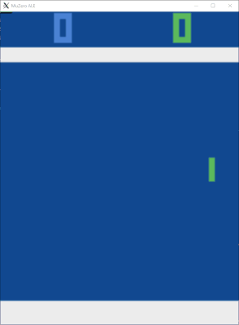
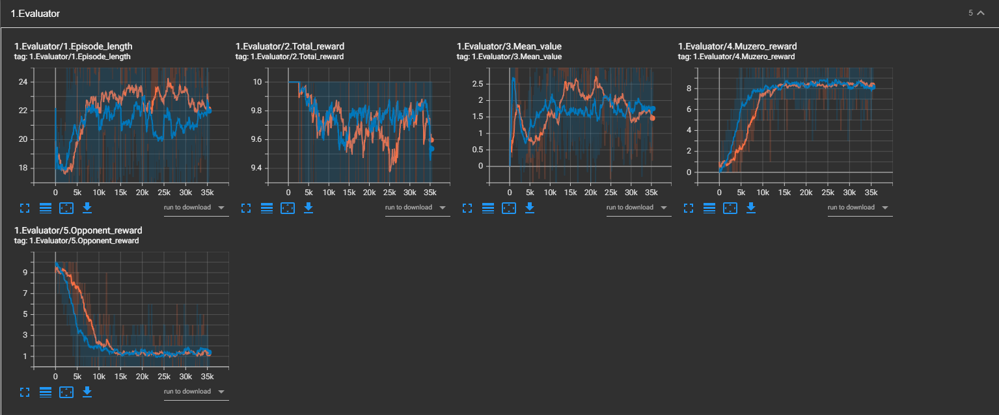
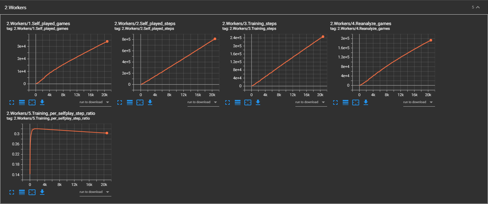
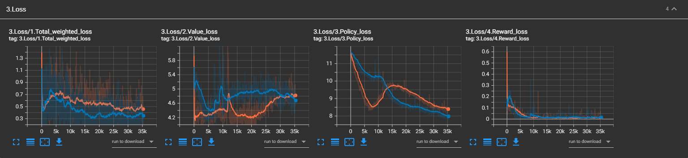

# MuZero-CPP

This project is a complete C++ implementation of the [MuZero](https://arxiv.org/abs/1911.08265) algorithm, inspired by the work done by [MuZero General](https://github.com/werner-duvaud/muzero-general).
The motivation behind this project is for the added speed C++ provides, efficient batched inference on the GPU, as well as working in C++ environments where we don't want to leave the C++ runtime.
There are still many optimization tricks that can be used to improve efficiency, but there aren't immediate plans to do so.

**Note**: I can't guarantee that this implementation is bug-free, as I don't have the computational resources to compare against some of the reported results.



## Features

- Multi-threaded async actor inference
- Multiple device (CPUs and GPUs) support for learning and inference
- Reanalyze for fresh buffer values (both value and policy updates)
- Complex action representation options
- Priority replay buffer
- Tensorboard metric logging
- Model configuration through json (see `models/`)
- Model, buffer, and metric checkpointing for resuming
- Easy to add environments
- Play against the learned model (2 player games) in testing
- Support for ALE

## Dependencies

The following libraries are used in this project. We ues vcpkg to manage the dependencies (except libtorch)

- [abseil-cpp](https://github.com/abseil/abseil-cpp)
- [libnop](https://github.com/google/libnop)
- [tensorboard_logger](https://github.com/RustingSword/tensorboard_logger)
- [libtorch](https://pytorch.org/)
- [ALE](https://github.com/mgbellemare/Arcade-Learning-Environment), `sdl2`, `sdl2_image`, and `OpenCV` if using the ALE wrapper (**Note**: v0.7.4 or newer is required, as older versions of ALE doesn't link with libtorch.)

Some source files are also taken from (and) modified [OpenSpiel](https://github.com/deepmind/open_spiel), and have the corresponding Copyright notice included as well.

## Building Examples
All dependencies are managed through [vcpkg](https://vcpkg.io/en/), except for `libtorch` (pytorch's C++ frontend). 
The easiest way to get `libtorch` is through the python package.
First, create a virtual environment and install pytorch:
```shell
conda create -n muzero python=3.12
conda activate muzero
pip3 install torch torchvision
```

Next, the following environment variables are required for the toolchain packages to be found:
- `CC`: The path to your C compiler
- `CXX`: The path to your C++23 compliant compiler
- `LIBTORCH_ROOT`: The path to the libtorch package, which we will point towards the just installed python package

For example:
```shell
export CC=gcc-15.2
export CXX=g++-15.2
# Ensure you activated the muzero virtual environment
export LIBTORCH_ROOT=`python3 -c 'import torch;print(torch.utils.cmake_prefix_path)'`
```

Finally, we use `CMakePresets.json` which sets all the required CMake variables.
```shell
cmake --preset=release-linux
cmake --build --preset=release-linux -- -j8
```

> [!IMPORTANT]
> If you see a CMake warning about an RPATH cycle involving `libtorch/libc10`
> (often caused by vcpkg reusing an older cached build of a dependency which references a different virtual environment),
> delete the build folder, and request to not reuse cached artifacts when configuring:
> `VCPKG_BINARY_SOURCES=clear cmake --preset=release-linux`


## Example Usage

Included are a few examples which show how to add a new environment, and interact with the learning and testing.
There are predefined command line arguments to parameterize the MuZero algorithm (see [default_flags.cpp](./include/muzero/default_flags.cpp) or use the --help option when running). Note that the devices are listed as comma separated, following the `torch` notation.
You can also add additional command line arguments by adding `ABSL_FLAG`s (see the examples).

Some important arguments to consider:

- `path` The directory which will be used for checkpointing and resuming.
- `devices` Torch style comma separated list of devices which a model will be spawned on for each item. A minimum of 2 is needed for training, with the first listed being used solely for training and the rest using lagged target network for inference/testing. E.g.
  - `--devices "cuda:0,cuda:0"`
  - `--devices "cuda:0,cuda:1"`
  - `--devices "cuda:0,cpu"`
- `min_sample_size` Should be at least as big as `batch_size`
- `num_actors` Number of self-play actor threads to spawn.
- `num_reanalyze_actors` Number of reanalyze actor threads to spawn.
- `train_reanalyze_ratio` Ratio of samples the learner will sample from the reanalyze buffer. This should probably match the ratio of actors you spawn for self-play/reanalyze to keep things efficient.
- It is also recommended to have `initial_inference_batch_size` and `recurrent_inference_batch_size` equal to the number of total actors, as this will increase the efficiency by batching inference queries rather than having threads wait for a model to become available.

### Training

One can train Connect4 by the following:

```shell
# Run the connect4 binary without reanalyze
./build/release-linux/examples/connect4/muzero_connect4 --num_actors=10 --initial_inference_batch_size=10 --recurrent_inference_batch_size=10 --devices="cuda:0,cuda:0" --batch_size=256 --min_sample_size=512 --value_loss_weight=0.25 --td_steps=42 --num_unroll_steps=5 --checkpoint_interval=10000 --model_sync_interval=1000 --num_simulations=50 --max_training_steps=250000 --export_path=examples/connect4/reanalyze-00 --model_path=models/model_small.json

# Run the connect4 binary with 50% of samples coming from reanalyze
./build/release-linux/examples/connect4/muzero_connect4 --num_actors=5 --num_reanalyze_actors=5 --initial_inference_batch_size=10 --recurrent_inference_batch_size=10 --train_reanalyze_ratio=0.5 --devices="cuda:0,cuda:0" --batch_size=256 --min_sample_size=512 --value_loss_weight=0.25 --td_steps=42 --num_unroll_steps=5 --checkpoint_interval=10000 --model_sync_interval=1000 --num_simulations=50 --max_training_steps=250000 --export_path=examples/connect4/reanalyze-50 --model_path=models/model_small.json
```

### Safely Pausing

To pause the training, issue an abort signal `<CTRL + C>` and the current state of the algorithm will be checkpointed (checkpoints are done periodically as well).

### Resume Training

To resume training, issue the same command which was used for training, but add the flag `--resume`. Note that some command line arguments can be changed, while others are checked and enforced (i.e. replay buffer max size). Not every case is checked, so it is best to use exactly the same arguments.

```shell
# Run the connect4 binary with the appropriate arguments
./build/release-linux/examples/connect4/muzero_connect4 --num_actors=10 --initial_inference_batch_size=10 --recurrent_inference_batch_size=10 --devices="cuda:0,cuda:0" --batch_size=256 --min_sample_size=512 --value_loss_weight=0.25 --td_steps=42 --num_unroll_steps=5 --checkpoint_interval=10000 --model_sync_interval=1000 --num_simulations=50 --max_training_steps=250000 --export_path=examples/connect4/reanalyze-00 --model_path=models/model_small.json --resume
```

### Testing Against the Trained Agent

The `muzero::play_test_model` function can be used to test a trained model.
The invocation should be the same as used to train (only some of the arguments are needed but its safe to use all the args used in training), but with an addition `--test` command line argument (assuming you implement this, see the examples for details).
By default, the most recent checkpointed model during training will be loaded.
To load the best performance model during training, use the `--testing_checkpoint=-2` argument.


The opponent listed in the `config.opponent_type` is used during testing.
For 2 player games, you can manually play against your bot by setting `config.opponent_type = types::OpponentTypes::Human`.

### Examining Metrics

The tensorboard metric file is saved at `config.path/metrics/tfevents.pb`. To view the metrics while training, run your normal tensorboard command:

```shell
cd examples/connect4/
tensorboard --logdir=./metrics
```

Note that this requires a tensorboard python installation (i.e. conda or pip).

## Adding Environments

To add a new environment, you must implement the following:

- Create a new directory containing your environment under `./examples`
- A game which extends [abstract_game.h](./include/muzero/abstract_game.h)
- A `Config` which specifies the `action_representation` function, and`visit_softmax_temperature` function at a minimum (these can't really be specified as command line arguments)
- A source file which contains the entry point (`main` with call to `muzero::muzero(config, game_factory<YOUR_GAME_CLASS_NAME>)`)
- An optional added function call to `muzero::play_test_model` to test your trained agent
- Create a `CMakeLists.txt` to compile your example and add the directory to the parent `CMakeLists.txt`

See the examples for proper usage.

## Pretrained Models

Included is a pretrained model on the Connect4 environment.
To test the pretrained model, use the following command:

```shell
./build/release-linux/examples/connect4/muzero_connect4 --devices="cpu" --num_simulations 50 --export_path=examples/connect4/reanalyze-00 --model_path=models/model_small.json --test
```

Included as well is a pretrained model on the pong ALE environment. Note that we do not include any ROMS.
To test the pretrained model, use the following command:

```shell
./build/release-linux/examples/ale/muzero_ale --num_actors=5 --num_reanalyze_actors=5 --initial_inference_batch_size=10 --recurrent_inference_batch_size=10 --devices=cuda:0,cuda:0 --batch_size=256 --min_sample_size=512 --value_loss_weight=0.25 --td_steps=10 --num_unroll_steps=5 --checkpoint_interval=10000 --model_sync_interval=1000 --num_simulations=25 --max_training_steps=2000000 --export_path=examples/ale/pong --model_path=models/model_ale.json --replay_buffer_size=20000 --reanalyze_buffer_size=100000 --train_reanalyze_ratio=0.5 --max_history_len=200 --episodic_pong --game_file_path=pong.bin --stacked_observations=6 --frame_skip=4 --min_reward=-1 --max_reward=1 --min_value=-21 --max_value=21 --test
```

## Performance

The choice of using C++ was for environment constraints and added performance that could be gained instead of dealing with threading in python.
There are certainly many improvements that can be made to this codebase, and they are welcomed.

The following metrics are on training the Connect4 environment on a stock Intel 7820X, 64GB of system memory, Nvidia 3090, running on Ubuntu 20.04 using the Release build flags. The runtime configuration is given in the command window below for an extended training session. Note that Connect4 can be solved in much fewer training steps, this is simply a performance test.

- Total training time of 9:48:43
- ~13.5 training steps per second
- ~39.7 self play steps per second

```shell
./build/release-linux/examples/connect4/muzero_connect4 --num_actors=10 --initial_inference_batch_size=10 --recurrent_inference_batch_size=10 --devices="cuda:0,cuda:0" --batch_size=256 --min_sample_size=512 --value_loss_weight=0.25 --td_steps=42 --num_unroll_steps=5 --checkpoint_interval=10000 --model_sync_interval=1000 --num_simulations=50 --max_training_steps=500000 --export_path=examples/connect4/reanalyze-00 --model_path=models/model_small.json
```

## Tensorboard Metrics

The following metrics are tracked:

- Evaluator:
  - `Episode_length`: Length of the episode
  - `Total_reward`: Total reward received (includes both players in 2 player games)
  - `Mean_value`: Average root value along the trajectory
  - `Muzero_reward`: Reward received by the Muzero player
  - `Opponent_reward`: Reward received by the opponent
- Workers:
  - `Self_played_games`: Total number of games completed through self play by all actors
  - `Self_played_steps`: Total environment steps completed through self play by all actors
  - `Training_steps`: Total training steps (i.e. model updates)
  - `Reanalyze_games`: Total number of games which have had their root values and policy reanalyzed
  - `Reanalyze_steps`: Total number of game steps which have had their root values and policy reanalyzed
  - `Training_per_selfplay_step_ratio`: Ratio of training steps to self play and reanalyze steps, used to monitor if actors are feeding data to replay buffer too fast or if model is not being fed enough fresh trajectories
- Loss:
  - `Total_weighted_loss`: Total loss (minus l2) weighted by importance sampling and the value loss scale
  - `Value_loss`: Unweighted loss on the value prediction from the prediction network
  - `Policy_loss`: Unweighted loss on the policy prediction from the prediction network
  - `Reward_loss`: Unweighted loss on the reward prediction from the dynamics network




